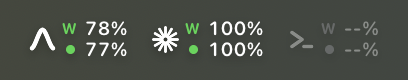
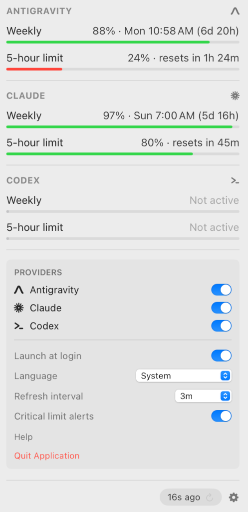

# agent-usage-limits-macos 🤖📊

A native, lightweight macOS menu bar application designed to monitor your AI coding assistant usage quotas in real-time (supporting **Antigravity**, **Claude**, **Codex**, and custom providers via a modular plugin architecture).

[](https://github.com/hector6872/agent-usage-limits-macos/releases)
[](https://github.com/hector6872/agent-usage-limits-macos/actions/workflows/release.yml)
[](https://www.apple.com/macos/)
[](https://www.swift.org/)
[](https://developer.apple.com/xcode/swiftui/)
[](LICENSE)

<p align="center">
  
</p>
<p align="center">
  
</p>

---

## 🌟 Features

- **Menu Bar Integration**: Real-time quota tracking for multiple AI providers in a compact, tabular horizontal layout with adaptive Light/Dark mode typography.
- **Dual-Window Monitoring**:
  - **Session Limits**: Tracks short rolling windows (e.g. 5-hour rolling session limit).
  - **Weekly Limits**: Tracks rolling weekly allocations (e.g. Anthropic's 7-day limits).
  - **Smart Reset Timers**: Displays precise localized schedules and countdowns:
    - **Short Windows (< 24h)**: High-precision hours and minutes countdown (e.g. `resets in 1h 45m` / `reinicia en 1h 45m`).
    - **Weekly Windows (> 24h)**: Localized target day and time plus duration (e.g. `Sun 7:00 AM (5d 17h)` / `dom, 7:00 (5d 17h)`).
- **Live Provider Integration**:
  - **Antigravity**: Local language server probing (`agentapi`, `language_server`, `agy`, `gemini-cli`) & Google Cloud Code OAuth tokens.
  - **Claude**: 
    - Official Anthropic OAuth usage API (`https://api.anthropic.com/api/oauth/usage`) with automatic credential discovery from macOS Keychain (`Claude Code-credentials`), config files (`~/.claude/.credentials.json`), or environment variables.
    - Comprehensive multi-bucket parsing: monitors `seven_day_sonnet`, `seven_day`, `seven_day_opus`, and generic `limits` to track the most restrictive active limit.
    - Global weekly reset alignment: authoritative schedule anchored to Anthropic's global tumbling reset every **Sunday at 05:00 UTC** (07:00 AM CEST in Madrid, 01:00 AM EDT in New York).
    - Local fallback via Claude Desktop telemetry (`plan-usage-history.json`) and non-interactive CLI probing (`claude -p "/usage" --allowedTools ""`).
  - **Codex**: Official OAuth usage API (`https://chatgpt.com/backend-api/wham/usage`) with automatic token renewal and CLI fallback (`codex usage`).
- **Strict Process & Active State Detection**:
  - Automatically identifies whether an AI provider or CLI is actively running in the background. Inactive agents are cleanly represented (`--%` / `Not active`) without phantom usage.
- **Ceiling Rounding & Visual Alerts**:
  - Quota percentages are rounded up (`ceil`) for user clarity.
  - Critical levels ($< 25\%$) and exhausted limits ($0\%$) are highlighted in red.
- **System Notifications for Critical Limits**:
  - Native macOS alerts via `UNUserNotificationCenter` when any active provider drops into critical health on either session or weekly quotas (with smart deduplication).
- **Settings & Customization Drawer**:
  - Enable/disable individual providers.
  - Configurable auto-refresh frequency (1m, 3m, 5m, 15m, 30m) with 1-minute cooldown protection.
  - Critical quota notification toggle.
  - Native **Launch at Login** support via `SMAppService`.
  - Direct repository help link and application termination.
- **Multi-Language Support (i18n)**:
  - 🌐 Automatic system language detection + in-app language picker supporting **10 languages**:
    - 🇺🇸 **English** (`en`)
    - 🇪🇸 **Español** (`es`)
    - 🇫🇷 **Français** (`fr`)
    - 🇩🇪 **Deutsch** (`de`)
    - 🇮🇹 **Italiano** (`it`)
    - 🇵🇹 **Português** (`pt`)
    - 🇯🇵 **日本語** (`ja`)
    - 🇨🇳 **简体中文** (`zh-Hans`)
    - 🇰🇷 **한국어** (`ko`)
    - 🇷🇺 **Русский** (`ru`)
- **Zero External Dependencies**:
  - Pure Swift 6 built on SwiftUI, AppKit, and Foundation.

---

## 🔍 How Quota Tracking & Resets Work

| Provider | Session Window | Weekly Window | Reset Calculation & Sources |
| :--- | :--- | :--- | :--- |
| **Claude** 🟣 | 5-hour rolling session limit | 7-day multi-model allocation (`seven_day_sonnet`, `seven_day`, `seven_day_opus`) | **1. Anthropic OAuth API** (`https://api.anthropic.com/api/oauth/usage`) with Keychain token discovery.<br>**2. Global Tumbling Weekly Schedule**: Resets every **Sunday at 05:00 UTC** (07:00 AM CEST in Spain / 01:00 AM EDT in NY).<br>**3. Local Telemetry Fallback**: Analyzes `plan-usage-history.json` and probes CLI (`claude -p "/usage"`). |
| **Antigravity** 🔵 | 5-hour rolling session limit | Weekly prompt/token quota | Probes local language server socket (`agentapi`, `language_server`, `agy`) and Google Cloud Code OAuth tokens. |
| **Codex** 🟢 | 5-hour sliding prompt limit | Weekly allocation limit | Official ChatGPT/Codex OAuth usage endpoint (`https://chatgpt.com/backend-api/wham/usage`) with automatic token renewal and `codex usage` CLI fallback. |

### Reset Time Formatting
- **Resets $> 24\text{h}$ away** (e.g. Weekly quota): Formatted with localized day of week, local time, and duration breakdown:
  - *Spanish*: `dom, 7:00 (5d 17h)`
  - *English*: `Sun 7:00 AM (5d 17h)`
- **Resets $< 24\text{h}$ away** (e.g. 5-hour session window): Formatted with exact hours and minutes:
  - `reinicia en 1h 45m` / `resets in 1h 45m`

---

## 📦 Installation & Download

### Option 1: Download Pre-built Release (Recommended)

1. Download the latest `AgentUsageLimits-macOS.zip` from the [Releases](https://github.com/hector6872/agent-usage-limits-macos/releases/latest) page.
2. Unzip and drag `AgentUsageLimits.app` to your `/Applications` folder.

> [!NOTE]
> ### 🛡️ macOS Gatekeeper & Unsigned App Notice
> As a free, independent open-source project, this app is **not code-signed with a paid Apple Developer certificate** (\$99/year). 
>
> When launching the pre-built binary for the first time, macOS Gatekeeper may show a warning:  
> *"AgentUsageLimits can’t be opened because Apple cannot check it for malicious software"* or *"Unidentified Developer"*.
>
> **To open the app:**
> 1. **Option A (GUI - One-time)**: **Right-click** (or `Control`-click) on `AgentUsageLimits.app` in Finder $\rightarrow$ click **Open** $\rightarrow$ click **Open** on the dialog.  
>    *(Alternatively, go to **System Settings** $\rightarrow$ **Privacy & Security**, scroll down to the Security section, and click **Open Anyway**).*
> 2. **Option B (Terminal)**: Strip the quarantine attribute:
>    ```bash
>    xattr -cr /Applications/AgentUsageLimits.app
>    ```

---

### Option 2: Build from Source

Since local compilation is self-signed on your machine, it avoids Gatekeeper quarantine flags altogether:

```bash
# 1. Clone the repository
git clone https://github.com/hector6872/agent-usage-limits-macos.git
cd agent-usage-limits-macos

# 2. Compile and launch in the menu bar
make run

# 3. (Optional) Install directly to /Applications
make install
```

### Useful Make Commands

| Command | Description |
| :--- | :--- |
| `make build` | Compiles the Swift package in debug mode. |
| `make release` | Compiles an optimized release build. |
| `make bundle` | Packages the application into `dist/AgentUsageLimits.app`. |
| `make run` | Bundles and launches the application in the menu bar. |
| `make dev` | Runs the app directly in console mode for live debugging. |
| `make install` | Installs `AgentUsageLimits.app` into `/Applications/`. |
| `make stop` | Terminates any running instances of the app. |
| `make clean` | Cleans build artifacts and generated application bundles. |

---

## 🔌 Plugin Architecture: Adding a New Provider

The project uses a modular provider interface. To add support for another AI assistant, implement the [`UsageProvider`](Sources/AgentUsageLimits/Protocols/UsageProvider.swift) protocol:

```swift
import Foundation

public final class CustomAIProvider: UsageProvider, @unchecked Sendable {
    public let id: String = "custom-ai"
    public let displayName: String = "Custom AI"
    public let iconSymbol: String = "sparkles" // SF Symbol or custom brand symbol
    
    /// Short sliding session window in hours (e.g. 5.0h)
    public let shortWindowDurationHours: Double
    public var isEnabled: Bool = true
    
    public init(shortWindowDurationHours: Double = 5.0, isEnabled: Bool = true) {
        self.shortWindowDurationHours = shortWindowDurationHours
        self.isEnabled = isEnabled
    }
    
    public var isActive: Bool {
        // Return true if the provider GUI or CLI is currently running
        return true
    }
    
    public func fetchUsage() async throws -> ProviderUsage {
        let now = Date()
        let shortReset = now.addingTimeInterval(3600 * 2.5)
        let weeklyReset = now.addingTimeInterval(86400 * 3.0)
        
        let shortWindow = QuotaWindow(
            name: "\(Int(shortWindowDurationHours))-hour limit",
            windowDurationHours: shortWindowDurationHours,
            usedPercent: 15.0,
            resetDate: shortReset
        )
        
        let weeklyWindow = QuotaWindow(
            name: "Weekly",
            windowDurationHours: 168.0,
            usedPercent: 40.0,
            resetDate: weeklyReset
        )
        
        return ProviderUsage(
            providerId: id,
            displayName: displayName,
            iconSymbol: iconSymbol,
            isActive: isActive,
            shortWindow: shortWindow,
            weeklyWindow: weeklyWindow,
            showWeeklyInMenuBar: true,
            lastUpdated: now
        )
    }
}
```

Then register the new provider in [`UsageManager.swift`](Sources/AgentUsageLimits/Services/UsageManager.swift):

```swift
self.providers = [
    AntigravityUsageProvider(),
    ClaudeUsageProvider(),
    CodexUsageProvider(),
    CustomAIProvider() // <-- Add your provider here
]
```

*(Or dynamically at runtime via `usageManager.register(provider: CustomAIProvider())`)*

Custom vector brand icons can be added to [`BrandIcons.swift`](Sources/AgentUsageLimits/Views/BrandIcons.swift).

---

## 🌐 Localization (i18n)

Translations are organized in standard `Localizable.strings` files inside `Sources/AgentUsageLimits/Resources/`:

```
Sources/AgentUsageLimits/Resources/
├── en.lproj/Localizable.strings      # English (Default)
├── es.lproj/Localizable.strings      # Spanish
├── fr.lproj/Localizable.strings      # French
├── de.lproj/Localizable.strings      # German
├── it.lproj/Localizable.strings      # Italian
├── pt.lproj/Localizable.strings      # Portuguese
├── ja.lproj/Localizable.strings      # Japanese
├── zh-Hans.lproj/Localizable.strings # Simplified Chinese
├── ko.lproj/Localizable.strings      # Korean
└── ru.lproj/Localizable.strings      # Russian
```

---

## 🤝 Contributing

Contributions, feature requests, and bug reports are welcome! Please check out the [CONTRIBUTING.md](CONTRIBUTING.md) guide for details.

---

## 📄 License

This project is licensed under the MIT License - see the [LICENSE](LICENSE) file for details.
